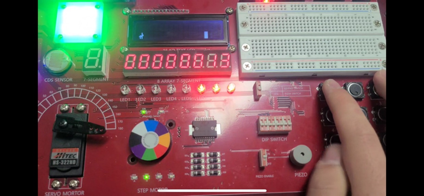
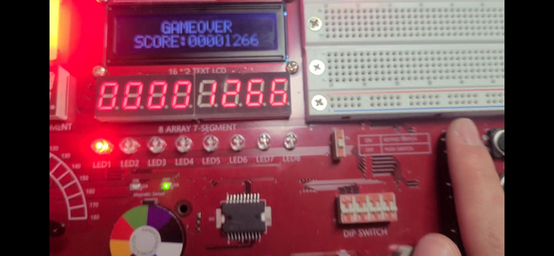

# 2024_logic-circuit-design-and-LAB_BunnyLAB
2024년도 부산대학교 논리회로설계및실험 수업에서 텀프로젝트로 만든 게임입니다.

## 목차
1. [실행환경](#실행환경)
2. [사용모듈](#사용모듈)
3. [코드구성](#코드구성)
4. [게임구성](#게임구성)

## 실행환경
- windows 11 pro
### 소프트웨어
- [Quartus](https://www.intel.com/content/www/us/en/software-kit/660907/intel-quartus-prime-lite-edition-design-software-version-20-1-1-for-windows.html)(20.1.1)
- [Vivado](https://www.xilinx.com/support/download/index.html/content/xilinx/en/downloadNav/vivado-design-tools/archive.html)(Vivado Design Suite - HLx Editions - 2020.1  Full Product Installation)
### 실행보드
- [HBE-Combo II DLD](https://hanback.com/ko/archives/4125)(ver 1.0 , 1MHZ로 클럭 고정 후 실행)

### Vivado 환경구성
- Family : Spartan-7
- Part : xc7s75fgga484-1
- vivado i/o port 설정시 아래와 같도록하고 핀번호만 다르게 구성

- [Pinmap](./Xilinx%20S7%20Pin%20Map.xlsx)

## 사용 모듈
- 16*2 Text LCD
    - 게임화면
- LED         
    - 목숨표기
- Step motor
    - 게임 진행 속도 표기
- keypad
    - 조작키, 리셋, 시작 버튼
- 8 Array 7 Segment
    - 실시간 점수 표기
- PIZEO
    - 게임 진행 BGM 출력, 게임오버 BGM 출력
- Colored LED
    - 평상시 초록색, 피격시 빨간색 점등

## 코드구성
- Quartus에서 verilog로 이루어진 V파일과 이를 심볼로 이용한 main_text.bdf 파일을 구성
- Quartus를 이용해 bdf파일을 V파일로 변환 후 Vivado로 이동
- Vivado에서 모든 컴파일을 진행후 보드로 업로드

## 게임구성
- 게임 시작

- 게임 진행시

- 게임 오버

